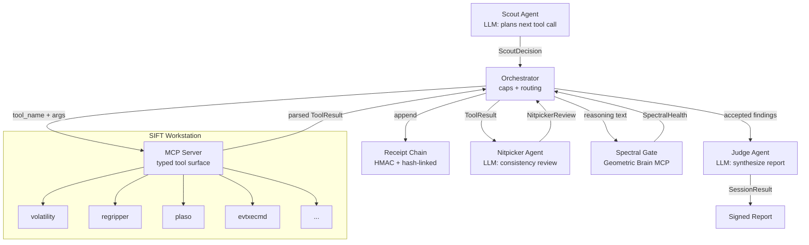

# Aletheia Sentinel

**Autonomous incident response on the SANS SIFT Workstation,
with spectral self-correction to catch agent hallucinations before they reach the case file.**

[](https://findevil.devpost.com/)
[](LICENSE)
[](https://github.com/holeyfield33-art/aletheia-sentinel/actions)

---

## The Problem

An AI-powered adversary can go from initial access to full domain control in under eight minutes.
Human incident responders are still pulling up their toolkit.
The SANS SIFT Workstation has over 200 forensic tools, but a skilled analyst can only run a few
before an attacker pivots, exfiltrates, or destroys evidence.
Autonomous triage needs to be fast, auditable, and hallucination-resistant -- three properties
that are structurally in tension unless the system is designed from the ground up around them.

---

## The Approach

Three structural differentiators, not just better prompts:

- **Pattern 2: Typed MCP tool surface, not a shell.**
  The agent calls `volatility_pslist(memory_image=...)`, not `bash("vol.py ...")`.
  Destructive commands are not in the tool surface; the agent physically cannot run them.
  Every tool argument passes through Pydantic validation before any subprocess touches disk.

- **Pattern 3: Multi-agent pipeline with HMAC hash-linked audit receipts.**
  Scout plans tool calls, Nitpicker reviews each result for consistency, Judge synthesizes
  the final report. Every tool execution writes a receipt that points at the previous
  receipt's SHA-256 digest. Tampering breaks the chain. Any finding can be traced back
  to the exact subprocess call that produced it.

- **Spectral self-correction (the differentiator).**
  Nitpicker reasoning text is scored by the
  [Geometric Brain MCP server](https://geometric-brain-mcp.onrender.com),
  which measures GUE eigenvalue spacing as a proxy for reasoning coherence.
  When the agent's reasoning drifts from a healthy manifold (r < 0.40),
  the finding is rejected and re-investigated. This is spectral self-correction
  infrastructure (calibration against hallucination ground truth is parallel
  research -- see accuracy report).

---

## Try It Out

```bash
# Clone and install
git clone https://github.com/holeyfield33-art/aletheia-sentinel.git
cd aletheia-sentinel
pip install -e '.[dev]'

# Set the HMAC receipt secret (required for run/verify; not needed for demo)
export ALETHEIA_RECEIPT_SECRET="$(python -c 'import secrets; print(secrets.token_hex(32))')"

# Run the scripted demo (no API key, no SIFT tools required)
sentinel demo

# Verify the receipt chain written by the demo
# (the demo prints the exact export command and chain path)
export ALETHEIA_RECEIPT_SECRET=<value printed by demo>
sentinel verify audit-logs/demo-seed42-<timestamp>.jsonl

# Run the full test suite
pytest
```

For a live investigation against real SIFT evidence (requires SIFT Workstation + API key):

```bash
export ANTHROPIC_API_KEY=sk-ant-...
sentinel run my-case-001 --image /evidence/win10-workstation.vmem
```

---

## Architecture



Full component descriptions and invariants: [docs/architecture.md](docs/architecture.md)

---

## Trust Boundaries

| Boundary | Caller | Callee | Trust level | Notes |
|----------|--------|--------|-------------|-------|
| MCP tool call | Orchestrator | MCP Server | Trusted | Typed Pydantic args; no shell interpolation |
| SIFT subprocess | MCP Server | OS process | Untrusted output | Stdout parsed before crossing back |
| LLM API | Scout / Nitpicker / Judge | Anthropic | Semi-trusted | Outputs validated; spectral gate adds second opinion |
| Spectral gate | Orchestrator | geometric-brain-mcp | External | r_ratio validated; network failure returns CAUTION |
| Receipt chain | Orchestrator | Memory / disk | Verified at read | verify() re-validates HMAC before final report |

Full trust boundary table: [docs/architecture.md](docs/architecture.md)

---

## Accuracy

See [docs/accuracy-report.md](docs/accuracy-report.md) for the full report with methodology disclosure.

Summary (mocked tool execution against 3 fixture cases):

| Metric | Value |
|--------|-------|
| Mean Precision | 1.000 |
| Mean Recall | 0.667 |
| Mean F1 | 0.767 |

**These numbers come from mocked execution against fixture cases, not real SIFT evidence.**
The benchmark harness infrastructure is complete; real measurement requires a live SIFT
Workstation with actual memory images and event logs. See the report for full disclosure.

---

## Repo Layout

```
src/sentinel/
  audit/        HMAC receipt chain (receipts.py)
  tools/        Typed SIFT tool wrappers: pslist, netscan, amcache, log2timeline, evtxecmd
  agents/       Scout, Nitpicker, Judge (Claude), Orchestrator, wiring
  spectral/     Geometric Brain spectral gate
  benchmark/    Accuracy harness: cases, runner, scoring
  cli.py        sentinel server | run | benchmark | verify | demo
docs/
  architecture.md     Component diagram, trust boundaries, termination caps
  accuracy-report.md  Benchmark results with methodology disclosure
benchmark/
  fixtures/           Three fixture cases (credential theft, lateral movement, persistence)
scripts/
  generate_accuracy_report.py   Regenerates docs/accuracy-report.md from fixture cases
tests/                101 tests, all green
```

---

## Built On

- [aletheia-cyber-core](https://pypi.org/project/aletheia-cyber-core/) --
  tri-agent pipeline, HMAC audit receipts, Ed25519 policy manifests
- [mneme](#) -- FastMCP server patterns, typed tool surfaces
- [geometric-brain-mcp](https://geometric-brain-mcp.onrender.com) --
  GUE eigenvalue spacing health checks (the spectral gate)

---

## License

Apache 2.0. See [LICENSE](LICENSE).
