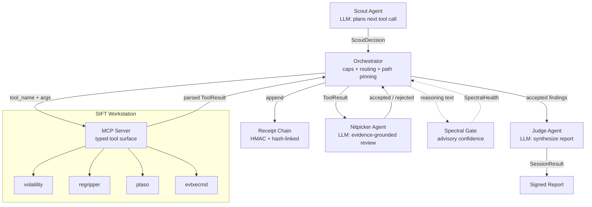

<div align="center">

# Aletheia Sentinel

**Autonomous incident response on the SANS SIFT Workstation, with
evidence-grounded self-correction -- every finding traces to a tool execution.**

[](https://findevil.devpost.com/)
[](LICENSE)
[](https://github.com/holeyfield33-art/aletheia-sentinel/actions/workflows/ci.yml)

*SANS "Find Evil!" Hackathon -- Architectural Approach #2: Custom MCP Server*

</div>

---

## What it does

Sentinel is a custom MCP server that gives an autonomous agent a typed forensic
tool surface -- `volatility_pslist`, `volatility_netscan`, `volatility_cmdline`,
`regripper_amcache`, `plaso_log2timeline`, `evtxecmd_security` -- instead of raw shell. A three-agent
loop (Scout plans, Nitpicker reviews, Judge synthesizes) triages a memory or
disk image and produces an incident report where every claim is backed by a
cryptographically-receipted tool execution.

Validated on real SANS SRL-2018 evidence across three hosts (wkstn-01, rd01,
wkstn-05) linked by a shared C2 (`172.16.4.10:8080`) and a proven directional
lateral link (rd01 -> wkstn-05 via inbound SMB) -- a documented multi-host,
multi-technique campaign. The pipeline surfaced the real implant (`p.exe` in
`c:\windows\temp\perfmon`), the WMI->PowerShell->rundll32 beacon chains, and
caught its own false positive: a binary first flagged as a backdoor was
correctly identified as F-Response forensic tooling via command-line evidence
-- a trap that recurred on all three hosts and was resolved by evidence each
time. All three receipt chains verify. Findings were independently verified
against raw Volatility output. See the
[accuracy report](docs/accuracy-report.md).

## Why it's safe by construction

- **Architectural guardrail, not a prompt.** Destructive commands aren't in the
  typed tool surface, so the agent physically cannot run them. Evidence paths
  are pinned server-side -- the agent cannot redirect a tool at an arbitrary
  file, and tools are gated by which evidence was actually provided.
- **Evidence-grounded self-correction.** The Nitpicker agent reviews every
  finding against the actual tool output and rejects unsupported claims before
  they reach the report. This is the reliable self-correction path.
- **Tamper-evident audit trail.** Every tool execution writes an HMAC-signed,
  hash-linked receipt (SHA-256 of input and output). Altering any receipt
  breaks verification -- findings trace to executions.
- **Spoliation-safe.** Read-only pipeline; the source image hash is unchanged
  after analysis, matching the original acquisition log.

*Experimental signal (advisory):* an optional spectral confidence score (via
Geometric Brain MCP) annotates findings. A calibration study across four models
found it weak and non-decisive (AUROC ~0.5-0.7), so it informs confidence but
is not relied on as a hallucination detector -- the decisive rejection path is
the Nitpicker's evidence-grounded review, with a deterministic
STRESSED->re-investigate guard retained in the orchestrator as defense-in-depth.
We report this honestly rather than claim a detector the data does not support.
Details in the [accuracy report](docs/accuracy-report.md).

## Quickstart (60 seconds, no API key)

```bash
pip install -e '.[dev]'
sentinel demo          # scripted investigation + verifiable receipt chain
```

`sentinel demo` runs a full scripted investigation with no API key and no SIFT
tools installed, then writes a receipt chain you can verify (the demo prints
the exact `sentinel verify` command and chain path).

## Run on real evidence

```bash
export ALETHEIA_RECEIPT_SECRET=$(python -c "import secrets;print(secrets.token_hex(32))")
export ANTHROPIC_API_KEY=sk-ant-...

# Requires Volatility 3 (`pip install volatility3`) for memory tools.
sentinel run my-case --image /path/to/memory.img
sentinel verify audit-logs/<chain>.jsonl
```

Tools are gated by the evidence provided: a memory image enables the Volatility
tools; a disk image enables plaso; a registry hive enables regripper; `.evtx`
logs enable evtxecmd. The agent is never offered a tool whose evidence is
absent.

## Architecture



Solid arrows are enforced control flow; the dashed spectral path is advisory.
Full trust-boundary table in [docs/architecture.md](docs/architecture.md);
pattern overview in [architecture.md](architecture.md).

## Development

All three checks pass on this revision:

```bash
ruff check src tests   # All checks passed!
mypy                   # Success: no issues found in 39 source files
pytest                 # 133 passed
```

## Part of the Aletheia ecosystem

Sentinel applies one thesis -- enforce safety architecturally, then prove it
with a tamper-evident audit trail -- to digital forensics. Sentinel runs
standalone (no other Aletheia repo is required to install or run it). Related
projects that share the same enforce-and-audit pattern in other domains:

- [Geometric Brain MCP](https://geometric-brain-mcp.onrender.com) -- spectral
  analysis server (optional, advisory signal only).
- Companion projects (not required): a runtime firewall applying the pattern at
  module-load time, and a red-team kit as the offensive counterpart that
  attacks the same surfaces these tools defend.

## Documentation

- [Accuracy Report](docs/accuracy-report.md) -- real-evidence validation,
  line-by-line findings verification, evidence integrity, and signing roadmap.
- [Dataset Documentation](docs/dataset-documentation.md) -- SANS SRL-2018
  provenance and per-host findings.
- [Fixture Benchmark](docs/fixture-benchmark.md) -- mocked regression
  benchmark with methodology disclosure.
- [Architecture](docs/architecture.md) -- components, trust boundaries,
  guardrails.

## License

Apache 2.0 -- see [LICENSE](LICENSE).
