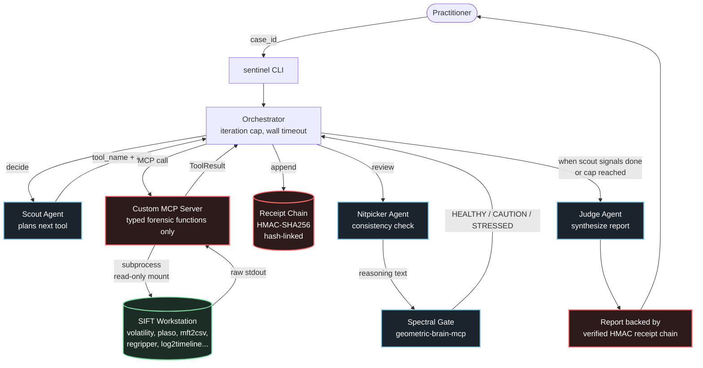

# Aletheia Sentinel — Architecture

## Pattern

This submission uses **two reinforcing architectural patterns** from the
hackathon brief:

- **Pattern 2 — Custom MCP Server.** SIFT tools are exposed as typed,
  Pydantic-validated functions. The agent cannot run arbitrary shell because
  arbitrary shell is not exposed. Destructive commands do not exist in the
  tool surface.
- **Pattern 3 — Multi-Agent Framework.** Scout → Nitpicker → Judge.
  Specialized roles, programmatic message logging, hard iteration cap.

Plus two differentiators outside the four named patterns:

- **Evidence-bounded classification.** Identity discipline is split across two
  agents: the Scout must verify a flagged process's identity from evidence
  (command line, or correlation of its network activity to known
  infrastructure) before concluding, and the Judge must not report a process as
  malicious, or let it drive the compromise verdict, unless that identity is
  established in the findings -- otherwise it is held as "suspicious pending
  verification." The Nitpicker is a consistency reviewer, not an evidence gate.
  Demonstrated on real SANS SRL-2018 evidence: on rd01 a suspected backdoor was
  identified as F-Response forensic tooling from its own network activity and
  command line; on hosts where that evidence is absent, the agent declines to
  assert malice (see [docs/accuracy-report.md](docs/accuracy-report.md), Section 2).
- **Spectral confidence annotation (experimental, off by default).** When
  enabled with `--spectral`, each Nitpicker review can be sampled by the
  [Geometric Brain MCP](https://geometric-brain-mcp.onrender.com) to compute the
  GUE eigenvalue-spacing health of the reasoning. A deterministic `STRESSED` ->
  re-investigate guard exists in the orchestrator,
  but a calibration study found the signal weak (AUROC ~0.5-0.7), so it is
  treated as advisory -- it annotates confidence and does not decide
  acceptance in practice (live calls return CAUTION). Disclosed honestly in
  the accuracy report.

## System diagram

## Trust boundaries

The brief asks judges to evaluate whether constraints are **architectural** or
**prompt-based**. Sentinel uses architectural enforcement at every layer that
matters; prompt-based instructions exist only as belt-and-suspenders on top.

| # | Boundary | Enforcement | Layer | What it prevents |
|---|----------|-------------|-------|------------------|
| 1 | Evidence is read-only | OS mount flag (`ro,noexec,nosuid`) | Kernel | Any write to original disk image, including by the agent or by a misbehaving SIFT tool |
| 2 | Tool surface is typed and finite | Pydantic schema in the MCP server | Compile-time | Arbitrary shell execution, command injection, calling tools the agent was not authorized for |
| 3 | Tool output is parsed before the LLM sees it | Server-side parser per tool | Server | Context-window overload from massive text dumps; prompt injection via tool output |
| 4 | Every execution produces an HMAC receipt | HMAC-SHA256, hash-linked chain | Cryptographic | Tampering with the audit log; forging findings; gaps in the trace |
| 5 | Classifications are bounded by evidence | Scout identity-verification rule + Judge evidence-bounded synthesis; Nitpicker consistency review | Prompt-level (with receipt-chain + termination-cap fallbacks) | A process asserted malicious on name/port alone; an unverified process driving the verdict (spectral gate is advisory/off by default; see accuracy report, Section 5) |
| 6 | Final report is backed by the verified receipt chain | `ReceiptChain.verify()` before report; HMAC-SHA256 | Cryptographic | Findings that do not trace to a receipted execution (Ed25519 asymmetric report signing is roadmap; primitive exists in companion `aletheia-cyber-core`) |
| 7 | Orchestrator has hard caps | `max_iterations`, `max_wall_seconds`, `max_consecutive_stressed` | Code-level | Runaway agent loops, infinite conversational spirals |

### What is *not* architectural

Honest disclosure for the accuracy report:

- **Scout's tool-selection reasoning** is prompt-based. The agent is told to
  verify a flagged process's identity from evidence before concluding, but
  nothing mechanically stops it from calling a read-only-but-expensive tool
  prematurely beyond the termination caps.
- **Nitpicker's consistency rubric** is prompt-based. The architectural
  fallbacks are the termination caps and the receipt chain; the spectral
  guard is mechanical but its signal is advisory (calibration study in the
  accuracy report).
- **Judge's tone** is prompt-based. The receipt chain backing the final
  report is architectural; the *wording* of the report is not.

These are documented in the accuracy report and tested for failure modes.

## Submission criteria mapping

| Hackathon criterion | Where it lives |
|---|---|
| 1. Autonomous Execution Quality (tiebreaker) | `agents/orchestrator.py` — iteration cap + re-investigate loop |
| 2. IR Accuracy | Scout identity-verification rule + Judge evidence-bounded synthesis (Nitpicker consistency review); real-evidence validation in [docs/accuracy-report.md](docs/accuracy-report.md) |
| 3. Breadth and Depth | `tools/` — typed wrappers per SIFT tool; depth via parser specialization |
| 4. Constraint Implementation | This document, Boundaries 1–7 above |
| 5. Audit Trail Quality | `audit/receipts.py` — hash-linked HMAC chain, traceable per finding |
| 6. Usability and Documentation | `README.md`, this file, `Try-It-Out` script |
