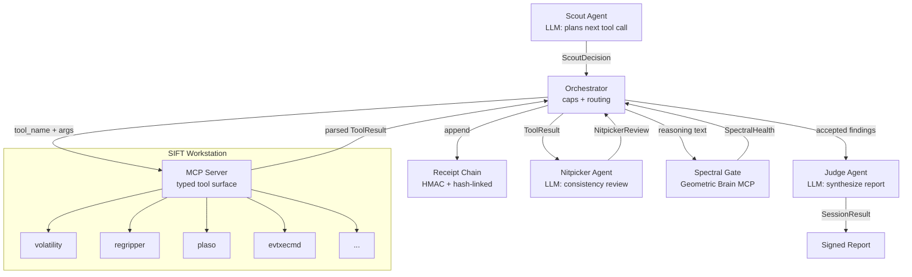

# Aletheia Sentinel - Architecture

## Pipeline diagram



## Tool Surface

The MCP server exposes **only** these five typed tools (Week 2 inventory):

- `volatility_pslist(memory_image)` -- Process list from memory image (Volatility 3)
- `volatility_netscan(memory_image)` -- Network connections (Volatility 3)
- `regripper_amcache(hive_file)` -- Amcache analysis via RegRipper
- `plaso_log2timeline(image_path, output_dir)` -- Full timeline (slow, outputs .plaso + sample)
- `evtxecmd_security(evtx_path, include_event_ids=None)` -- Filtered Security.evtx events

All calls are Pydantic-validated. No raw shell access.

## Component responsibilities

| Component | Role | Key invariant |
|-----------|------|---------------|
| Scout | Plans tool calls; decides when investigation is complete | Only source of `ScoutDecision`; never executes tools directly |
| Orchestrator | Owns termination caps, receipt chain, routing | Caps checked FIRST on every iteration; no cap can be bypassed |
| MCP Server | Exposes SIFT tools as typed Pydantic functions | No shell execution surface; destructive commands do not exist |
| Receipt Chain | Append-only HMAC hash-linked audit log | `verify()` must pass before any report is produced |
| Nitpicker | Reviews each fresh result for consistency | Returns NitpickerReview(accepted, reasoning); rejection routes to `rejected` pile |
| Spectral Gate | Scores Nitpicker reasoning coherence via GUE eigenvalue spacing | STRESSED = reject + increment counter; resets on HEALTHY |
| Judge | Synthesizes accepted findings into a final report | Reads-only `SessionState`; does not mutate |
| Benchmark Harness | Measures agent accuracy against ground-truth cases | Computes precision/recall/F1 per case; records wall time |

## Trust boundary table

| Boundary | Caller | Callee | Direction | Trust level | Notes |
|----------|--------|--------|-----------|-------------|-------|
| MCP tool call | Orchestrator | MCP Server | in-process | Trusted | Typed Pydantic arguments; no shell interpolation |
| SIFT subprocess | MCP Server | OS process | outbound | Untrusted output | Stdout is parsed into structured types before crossing back |
| LLM API | Scout / Nitpicker / Judge | External LLM | outbound | Semi-trusted | Outputs are validated against typed schemas; classification is bounded by the Scout's identity-verification rule and the Judge's evidence-bounded synthesis, with the Nitpicker as a consistency reviewer; the spectral gate adds an advisory confidence annotation |
| Spectral gate | Orchestrator | geometric-brain-mcp.onrender.com | outbound HTTPS | External service | Response validated for numeric `r_ratio`; missing field raises ValueError, not silent HEALTHY; network failure returns CAUTION |
| Evidence images | MCP Server | Disk | read-only | Untrusted data | Never committed to git; never sent to LLM directly |
| Receipt chain | Orchestrator | Memory / disk | internal | Trusted at write, verified at read | `verify()` re-validates HMAC and hash pointers before final report |

## Termination caps

The orchestrator enforces three independent caps. Any single cap ending the
session produces a `SessionResult` with the appropriate `StopReason`.

| Cap | Default | Stop reason | Purpose |
|-----|---------|-------------|---------|
| `max_iterations` | 50 | `MAX_ITERATIONS` | Hard ceiling on Scout decisions |
| `max_consecutive_stressed` | 3 | `MAX_STRESSED` | Abort when spectral gate signals repeated incoherence |
| `max_wall_seconds` | 1800 | `WALL_TIMEOUT` | Real-time deadline for a triage session |

Caps are checked at the **start** of each iteration, before `scout.decide()`
is called, so a cap violation at iteration N is detected before N+1 begins.

## Spectral self-correction loop

```
Nitpicker reviews ToolResult
        |
        v  (NitpickerReview.reasoning fed to gate)
Spectral Gate scores reasoning prose via brain_health_check
        |
   r >= 0.55?  --> HEALTHY  --> reset counter, append to findings
   r >= 0.40?  --> CAUTION  --> treat same as HEALTHY (accept)
   r <  0.40?  --> STRESSED --> increment counter, route to rejected
                                if counter >= max_consecutive_stressed: ABORT
```

The gate now receives the Nitpicker's actual reasoning text (not raw tool
JSON). This makes the spectral analysis meaningful: hallucinations manifest
in natural-language prose, not in the structured output they evaluated.

The gate is wired to `https://geometric-brain-mcp.onrender.com/mcp` in
production using the MCP JSON-RPC protocol. Tests inject `FixedSpectralGate`
for deterministic behaviour without network calls. Network failures (ConnectError,
TimeoutException, HTTPStatusError) return CAUTION rather than STRESSED to avoid
penalising the session for infrastructure problems.

**Calibration status (advisory signal):** a calibration study across four
models found no spectral statistic that reliably separates coherent from
degenerate generation at the tested scales (AUROC ~0.5-0.7; see the
[accuracy report](accuracy-report.md), Section 5). The STRESSED routing above
is a deterministic, fully-tested mechanical guard, but on live runs the gate
returns CAUTION in practice (text-proxy r clusters at 0.41-0.43; errors
degrade to CAUTION), so it annotates confidence rather than deciding
acceptance. The reliable evidence-discipline path is the Scout's
identity-verification rule combined with the Judge's evidence-bounded
synthesis; the Nitpicker is a consistency reviewer, not an evidence gate.

## Measurement

### Accuracy Benchmark Methodology

The benchmark harness (`sentinel.benchmark`) addresses hackathon criterion #2
(IR Accuracy) by providing **measured** precision/recall/F1 against ground-truth
cases, rather than relying on subjective assessment.

**How it works:**

1. Each `Case` specifies a list of `ExpectedFinding` objects -- the ground
   truth for what the agent *should* discover in that scenario.
2. The benchmark runner creates a fresh `Orchestrator` per case (independent
   receipt chains, no state bleed between cases).
3. After the session completes, `compute_score()` compares the accepted
   `findings` in `SessionResult.state` against the expected findings.
4. **Matching rule**: a reported finding matches an expected finding when all
   `key_fields` are present in the tool result payload:
   - String values: substring match (expected value must appear inside actual value)
   - Numeric values (int/float in payload): exact float comparison
5. Standard IR metrics are computed: Precision = TP / (TP + FP),
   Recall = TP / (TP + FN), F1 = harmonic mean.

**Edge-case conventions:**
- Both expected and reported empty: P=R=F1=1.0 (trivially correct).
- Expected empty, reported non-empty: P=0.0 (all spurious).
- Reported empty, expected non-empty: R=0.0 (all missed), P=1.0 (no FP).

**Three fixture scenarios** are provided under `benchmark/fixtures/`:
1. Credential theft (mimikatz in memory, C2 connection)
2. Lateral movement (PsExec service install in Security.evtx)
3. Persistence via PowerShell-Empire stager (Amcache evidence)

These are **demonstration cases** pointing to hypothetical evidence paths,
used for regression of the matching logic
([fixture-benchmark.md](fixture-benchmark.md)). Real-evidence validation
against three SANS SRL-2018 memory images is documented in the
[accuracy report](accuracy-report.md).

**CLI:**
```bash
sentinel benchmark --cases benchmark/fixtures/cases.json --output report.md
```
