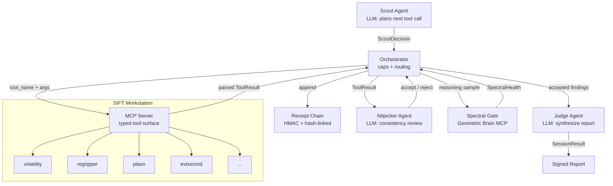

# Aletheia Sentinel - Architecture

## Pipeline diagram



## Tool Surface

The MCP server exposes **only** these five typed tools (Week 2 inventory):

- `volatility_pslist(memory_image)` — Process list from memory image (Volatility 3)
- `volatility_netscan(memory_image)` — Network connections (Volatility 3)
- `regripper_amcache(hive_file)` — Amcache analysis via RegRipper
- `plaso_log2timeline(image_path, output_dir)` — Full timeline (slow, outputs .plaso + sample)
- `evtxecmd_security(evtx_path, include_event_ids=None)` — Filtered Security.evtx events

All calls are Pydantic-validated. No raw shell access.

## Component responsibilities

| Component | Role | Key invariant |
|-----------|------|---------------|
| Scout | Plans tool calls; decides when investigation is complete | Only source of `ScoutDecision`; never executes tools directly |
| Orchestrator | Owns termination caps, receipt chain, routing | Caps checked FIRST on every iteration; no cap can be bypassed |
| MCP Server | Exposes SIFT tools as typed Pydantic functions | No shell execution surface; destructive commands do not exist |
| Receipt Chain | Append-only HMAC hash-linked audit log | `verify()` must pass before any report is produced |
| Nitpicker | Reviews each fresh result for consistency | Rejection routes to `rejected` pile, not `findings` |
| Spectral Gate | Scores reasoning coherence via GUE eigenvalue spacing | STRESSED = reject + increment counter; resets on HEALTHY |
| Judge | Synthesizes accepted findings into a final report | Reads-only `SessionState`; does not mutate |

## Trust boundary table

| Boundary | Caller | Callee | Direction | Trust level | Notes |
|----------|--------|--------|-----------|-------------|-------|
| MCP tool call | Orchestrator | MCP Server | in-process | Trusted | Typed Pydantic arguments; no shell interpolation |
| SIFT subprocess | MCP Server | OS process | outbound | Untrusted output | Stdout is parsed into structured types before crossing back |
| LLM API | Scout / Nitpicker / Judge | External LLM | outbound | Semi-trusted | Outputs are validated against typed schemas; hallucinations are caught by spectral gate |
| Spectral gate | Orchestrator | geometric-brain-mcp.onrender.com | outbound HTTPS | External service | Response validated for numeric `r_ratio`; missing field raises ValueError, not silent HEALTHY |
| Evidence images | MCP Server | Disk | read-only | Untrusted data | Never committed to git; never sent to LLM directly |
| Receipt chain | Orchestrator | Memory / disk | internal | Trusted at write, verified at read | `verify()` re-validates HMAC and hash pointers before final report |

## Termination caps

The orchestrator enforces three independent caps. Any single cap ending the
session produces a `SessionResult` with the appropriate `StopReason`.

| Cap | Default | Stop reason | Purpose |
|-----|---------|-------------|---------|
| `max_iterations` | 50 | `MAX_ITERATIONS` | Hard ceiling on Scout decisions |
| `max_consecutive_stressed` | 3 | `MAX_STRESSED` | Abort when spectral gate signals repeated incoherence |
| `max_wall_seconds` | 1800 | `WALL_TIMEOUT` | Real-time deadline for a triage session |

Caps are checked at the **start** of each iteration, before `scout.decide()`
is called, so a cap violation at iteration N is detected before N+1 begins.

## Spectral self-correction loop

```
Nitpicker reviews ToolResult
        |
        v
Spectral Gate scores reasoning sample
        |
   r >= 0.55?  --> HEALTHY  --> reset counter, append to findings
   r >= 0.40?  --> CAUTION  --> treat same as HEALTHY (accept)
   r <  0.40?  --> STRESSED --> increment counter, route to rejected
                                if counter >= max_consecutive_stressed: ABORT
```

The gate is wired to `https://geometric-brain-mcp.onrender.com/mcp` in
production. Tests inject `FixedSpectralGate` for deterministic behaviour
without network calls.